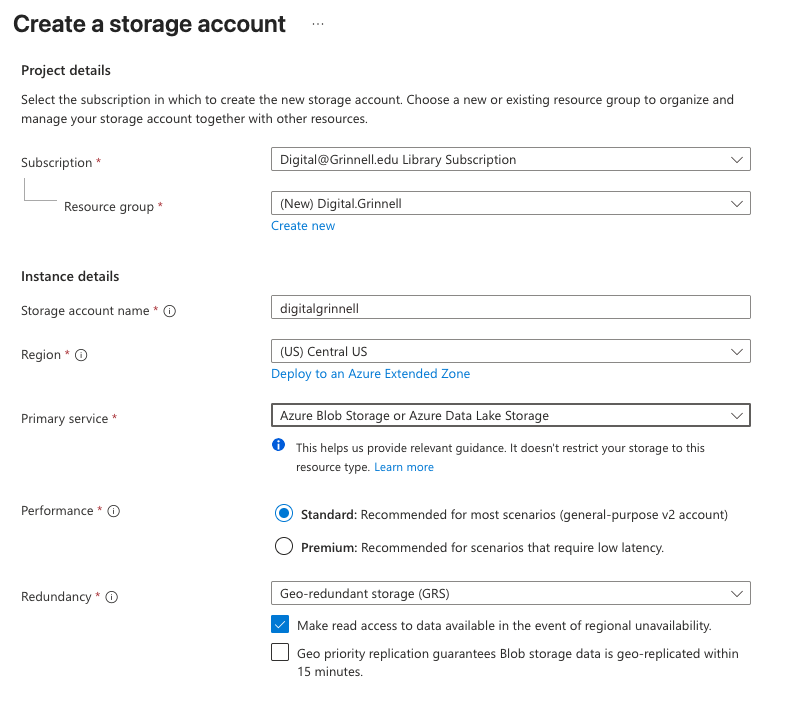

# HISTORY

This document is intended to capture the complete history of Digital.Grinnell.edu (in CollectionBuilder) development.  

## Started with a New Axure Store Account (and Resource Group)

The new storage account name is: `digitalgrinnell` and it's part of the new `Digital.Grinnell` resource group.  The following options were used to create the initial account.  



From there I accepted all the defaults to yield this review summary:  

**Basics**
Subscription: Digital@Grinnell.edu Library Subscription
Resource group: Digital.Grinnell
Location: Central US
Storage account name: digitalgrinnell
Primary service: Azure Blob Storage or Azure Data Lake Storage
Performance: Standard
Replication: Read-access geo-redundant storage (RA-GRS)

**Advanced**
Enable hierarchical namespace: Disabled
Enable SFTP: Disabled
Enable network file system v3: Disabled
Allow cross-tenant replication: Disabled
Access tier: Hot
Managed Identity for SMB: Disabled
Require Encryption in Transit for SMB: Enabled

**Security**  
Secure transfer: Enabled
Blob anonymous access: Disabled
Allow storage account key access: Enabled
Default to Microsoft Entra authorization in the Azure portal: Disabled
Minimum TLS version: Version 1.2
Permitted scope for copy operations (Preview): From any storage account
Enable Defender for Storage: Disabled

**Networking**
Public network access: Enabled
Public network access scope: Enabled from all networks
Default routing tier: Microsoft network routing

**Data Protection**  
Point-in-time restore: Disabled
Blob soft delete: Enabled
Blob retainment period in days: 7
Container soft delete: Enabled
Container retainment period in days: 7
Classic file share soft delete: Enabled
Classic file share retainment period in days: 7
Versioning: Disabled
Blob change feed: Disabled
Version-level immutability support: Disabled

**Encryption**  
Encryption type: Microsoft-managed keys (MMK)
Enable support for customer-managed keys: Blobs and files only
Enable infrastructure encryption: Disabled

## The JSON View 

/subscriptions/609af5e3-a5d8-4ff9-968f-6524767a4dbe/resourcegroups/Digital.Grinnell/providers/Microsoft.Storage/storageAccounts/digitalgrinnell

```json
{
    "sku": {
        "name": "Standard_RAGRS",
        "tier": "Standard"
    },
    "kind": "StorageV2",
    "id": "/subscriptions/609af5e3-a5d8-4ff9-968f-6524767a4dbe/resourceGroups/Digital.Grinnell/providers/Microsoft.Storage/storageAccounts/digitalgrinnell",
    "name": "digitalgrinnell",
    "type": "Microsoft.Storage/storageAccounts",
    "location": "centralus",
    "tags": {},
    "properties": {
        "dnsEndpointType": "Standard",
        "defaultToOAuthAuthentication": false,
        "publicNetworkAccess": "Enabled",
        "keyCreationTime": {
            "key1": "2026-09-02T19:51:49.0614560Z",
            "key2": "2026-09-02T19:51:49.0614560Z"
        },
        "allowCrossTenantReplication": false,
        "privateEndpointConnections": [],
        "minimumTlsVersion": "TLS1_2",
        "allowBlobPublicAccess": false,
        "allowSharedKeyAccess": true,
        "networkAcls": {
            "bypass": "AzureServices",
            "virtualNetworkRules": [],
            "ipRules": [],
            "defaultAction": "Allow"
        },
        "supportsHttpsTrafficOnly": true,
        "encryption": {
            "requireInfrastructureEncryption": false,
            "services": {
                "file": {
                    "keyType": "Account",
                    "enabled": true,
                    "lastEnabledTime": "2026-09-02T19:51:49.0717168Z"
                },
                "blob": {
                    "keyType": "Account",
                    "enabled": true,
                    "lastEnabledTime": "2026-09-02T19:51:49.0717168Z"
                }
            },
            "keySource": "Microsoft.Storage"
        },
        "accessTier": "Hot",
        "provisioningState": "Succeeded",
        "creationTime": "2026-09-02T19:51:48.7764343Z",
        "primaryEndpoints": {
            "dfs": "https://digitalgrinnell.dfs.core.windows.net/",
            "web": "https://digitalgrinnell.z19.web.core.windows.net/",
            "blob": "https://digitalgrinnell.blob.core.windows.net/",
            "queue": "https://digitalgrinnell.queue.core.windows.net/",
            "table": "https://digitalgrinnell.table.core.windows.net/",
            "file": "https://digitalgrinnell.file.core.windows.net/"
        },
        "primaryLocation": "centralus",
        "statusOfPrimary": "available",
        "secondaryLocation": "eastus2",
        "statusOfSecondary": "available",
        "secondaryEndpoints": {
            "dfs": "https://digitalgrinnell-secondary.dfs.core.windows.net/",
            "web": "https://digitalgrinnell-secondary.z19.web.core.windows.net/",
            "blob": "https://digitalgrinnell-secondary.blob.core.windows.net/",
            "queue": "https://digitalgrinnell-secondary.queue.core.windows.net/",
            "table": "https://digitalgrinnell-secondary.table.core.windows.net/"
        }
    }
}
```


